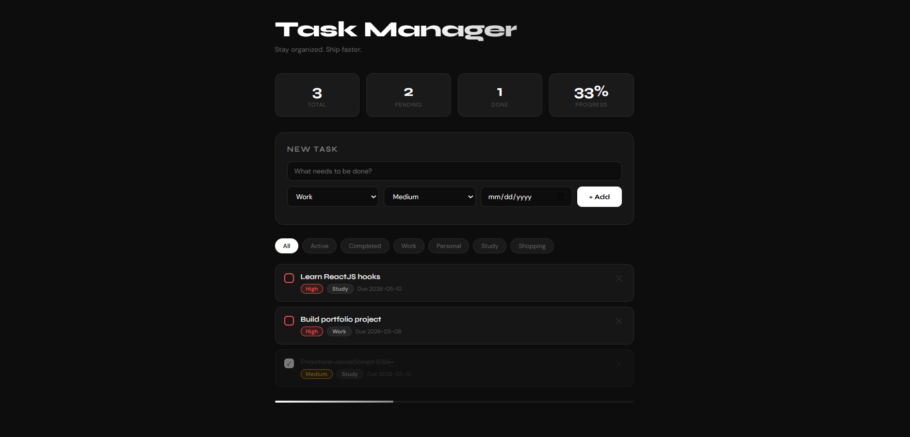

# Task Manager App ✦

A clean, dark-themed Task Manager built with ReactJS.

## Preview



## Features

- ✅ Add, complete, and delete tasks
- 🏷️ Priority levels — High, Medium, Low (color coded)
- 📂 Category filter — Work, Personal, Study, Shopping
- 📅 Due date with overdue warning
- 📊 Live stats — Total, Pending, Done, Progress %
- 📈 Progress bar

## Tech Stack

- ReactJS (Hooks — useState)
- CSS (custom, no external UI library)
- Google Fonts (Syne + DM Sans)

## Getting Started

### Prerequisites
- Node.js (v16 or above)
- npm

### Installation

```bash
# Clone the repo
git clone https://github.com/YOUR_USERNAME/task-manager.git

# Go into the project folder
cd task-manager

# Install dependencies
npm install

# Start the development server
npm start
```

The app will open at `http://localhost:3000`

## Project Structure

```
task-manager/
├── public/
│   └── index.html
├── src/
│   ├── App.js        # Main component with all logic
│   ├── App.css       # All styles
│   └── index.js      # Entry point
├── package.json
└── README.md
```

## Concepts Used

- `useState` for state management
- Conditional rendering
- Array methods — map, filter
- Props and event handlers
- Dynamic CSS styling based on state

---

Made with ❤️ using ReactJS
